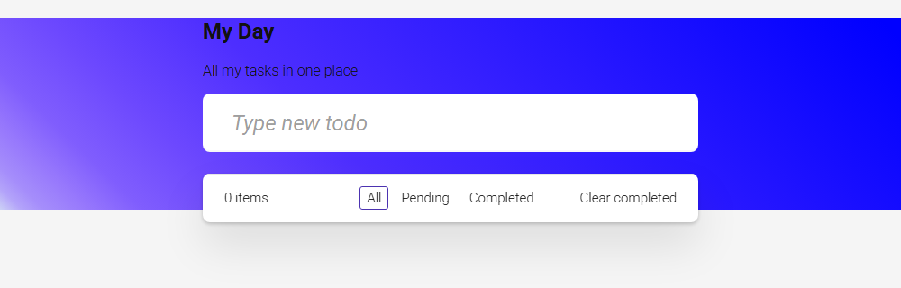

# Todo App

> A simple task manager built to practice Angular Signals-based reactivity, deployed on Firebase Hosting.



---

## 🧩 Problem / Context

Personal project built in 2025 to get hands-on with Angular's Signals API (`signal`, `computed`, `effect`) as a replacement for the classic RxJS + Zone.js change detection flow, using standalone components end to end.

---

## 🛠️ Stack

| Layer           | Technology            |
|-----------------|------------------------|
| Frontend        | Angular 18 (standalone components, Signals) |
| State           | Angular Signals (`signal`, `computed`, `effect`) |
| Persistence     | `localStorage`          |
| Deploy / Infra  | Firebase Hosting        |

---

## 🏗️ Architecture

- Standalone components (no `NgModule`), routed via `app.routes.ts`.
- Reactive state handled entirely with Signals: `tasks` as the source of truth, `tasksByFilter` as a `computed` derived view (all / pending / completed).
- An `effect()` syncs the `tasks` signal to `localStorage` on every change, so state survives a page reload without a backend.

---

## 🧠 Technical challenges and decisions

- **Problem:** persist tasks without adding a backend or database. → **Solution:** an `effect()` watches the `tasks` signal and writes it to `localStorage` on every change, restoring it on `ngOnInit`. → **Why:** keeps the app fully client-side while still surviving reloads — enough for the scope of this project.
- **Problem:** derive filtered views (all/pending/completed) without manual re-computation. → **Solution:** `computed()` over the `tasks` and `filter` signals. → **Why:** it recalculates automatically and only when its dependencies change, avoiding manual subscriptions.

---

## 🚀 Running it locally

```bash
git clone https://github.com/Carlou134/todo-app.git
cd todo-app
pnpm install
pnpm start
```

Navigate to `http://localhost:4200/`.
